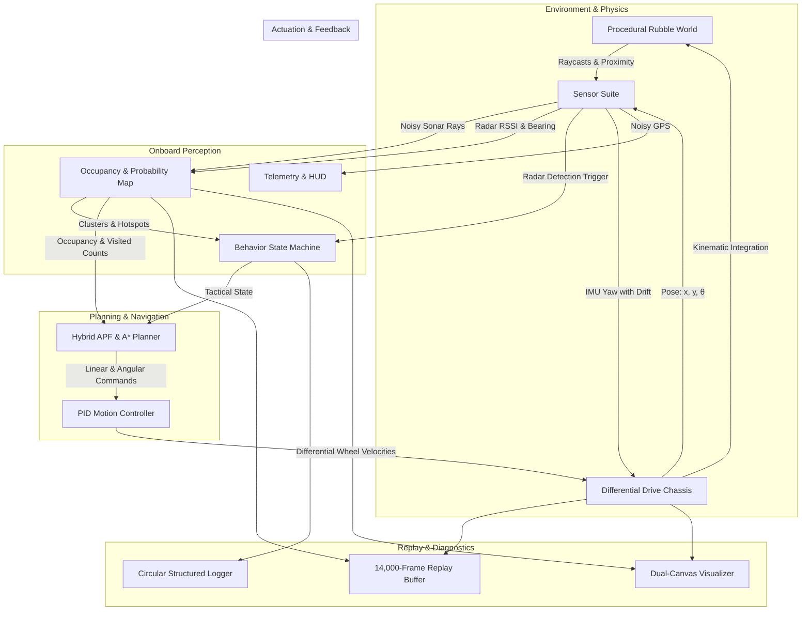

<div align="center">

# 🛰️ ARGUS-X SIM
### Autonomous Radar-Centric Search & Rescue Robot Simulation

[](LICENSE)
[](index.html)
[](src/)
[](package.json)
[](#)
[](.github/workflows/ci.yml)

<p align="center">
  <b>A physically grounded, zero-cheat simulation of an autonomous ground rover navigating collapsed disaster rubble in GPS-denied and vision-obscured environments.</b>
</p>

[Quick Start](#-quick-start) •
[System Architecture](#-system-architecture) •
[Sensor Suite](#-sensor-suite--hardware-realism) •
[Algorithms](#-algorithmic-foundations) •
[Controls](#-interactive-controls--hotkeys) •
[Documentation](#-documentation-index)

---

</div>

## 📌 Executive Overview

In disaster environments—such as collapsed concrete structures, active industrial fires, collapsed mine tunnels, and subterranean rubble voids—standard autonomous robotics stacks fail catastrophically:
- **LiDAR** suffers complete optical failure due to dense airborne particulates, steam, smoke, and reflective dust scatter.
- **RGB & Depth Cameras** are rendered useless by zero-lux conditions and physical occlusion.
- **GPS** is entirely blocked by reinforced concrete slabs and earth.

**ARGUS-X** is an autonomous search-and-rescue rover platform engineered around **24 GHz mmWave FMCW (Frequency-Modulated Continuous-Wave) radar**. Unlike optical sensors, millimeter-wave radio waves penetrate dust, smoke, and non-metallic debris, capturing micro-Doppler chest displacements ($0.5\text{--}5\text{ mm}$) generated by human respiration.

This simulation models the autonomous navigation, mapping, target identification, and recovery stack with **strict hardware realism**. The robot operates **without global map knowledge, without LiDAR, without vision, and without perfect localization**.

---

## ⚡ Core Capabilities

- **Realistic 24 GHz mmWave Radar Modeling**: Simulates path-loss exponential attenuation, human respiration phase modulation ($0.14\text{--}0.32\text{ Hz}$), directional beam divergence ($171^\circ$ FOV), hardware transport latency ($240\text{ ms}$), sensor noise, and false-positive spikes.
- **Triple-Acoustic Sonar Array**: Front and $\pm 45^\circ$ lateral ultrasonic transducers provide local obstacle boundary detection with Gaussian distance noise and beam jitter.
- **Persistent Bayesian Probability Grid**: $100 \times 100$ spatial uncertainty grid with mean-reverting ambient noise priors, directional beam projection, and 5-tap separable 2D Gaussian diffusion.
- **8-Connected Spatial Clustering**: Groups contiguous high-likelihood probability zones into actionable survivor target centroids with dynamic non-maximum suppression.
- **Hybrid Navigation Engine**: Combines continuous **Artificial Potential Fields (APF)** with momentum vector preservation, **Anti-Revisit Frontier A\* Search**, and automatic **boxed-trap escape recovery maneuvers**.
- **5-Phase Behavioral Finite State Machine**: Dynamic tactical transitions across `EXPLORE`, `WALL_FOLLOW`, `TRACK`, `CONFIRM`, and `REPLAY`.
- **Deterministic Replay & Time-Scrubbing**: High-capacity ring buffer capturing full vehicle kinematics, raycast states, and deep-cloned binary grid snapshots up to 14,000 frames ($>18\text{ minutes}$ of real-time mission scrub).
- **Dual Cyber-Tactical Viewports**: Simultaneous real-time rendering of physical world space and the robot's onboard internal probability/occupancy map.

---

## 📐 System Architecture

ARGUS-X follows a strictly decoupled, unidirectional perception-cognition-actuation data pipeline:



---

## 🛰️ Sensor Suite & Hardware Realism

All sensors simulate physical constraints, transmission latencies, and real-world noise parameters:

| Sensor Modeled | Physical Equivalent | Update Rate | Noise / Realism Characteristics |
| :--- | :--- | :--- | :--- |
| **mmWave FMCW Radar** | Hi-Link HLK-LD2410C ($24\text{ GHz}$) | $60\text{ Hz}$ | $180\text{ px}$ range, $171^\circ$ FOV, $240\text{ ms}$ processing latency queue, Gaussian RSSI noise ($\pm 0.06$), bearing error ($\pm 0.18\text{ rad}$), false positive rate ($1.2\%$), and exponential distance attenuation. |
| **Ultrasonic Sonar Array** | 3x HC-SR04 / RCWL-1601 | $60\text{ Hz}$ | Front ($0^\circ$), Left ($+45^\circ$), Right ($-45^\circ$). Raycasted against solid geometry with angular jitter ($\pm 0.6^\circ$) and Gaussian distance noise ($\pm 2.4\text{ px}$). |
| **Inertial Measurement (IMU)** | InvenSense MPU-6050 (6-DoF) | $60\text{ Hz}$ | Continuous heading yaw estimation with injected random-walk drift and jitter ($\pm 0.015\text{ rad}$). |
| **Degraded GPS** | Low-cost GNSS module | $2\text{ Hz}$ | Severe position noise ($\pm 4.5\text{ px}$). Used **exclusively for UI logging**; completely isolated from the robot's navigation stack. |
| **Differential Drive Motors** | 12V Metal DC Gearmotors | $60\text{ Hz}$ | Wheelbase $24\text{ px}$, chassis radius $10\text{ px}$, velocity smoothing filter ($\alpha = 0.78$), and acceleration limits ($78\text{ px/s}$ max linear, $3.4\text{ rad/s}$ max angular). |

---

## 🧠 Algorithmic Foundations

### 1. Artificial Potential Fields (APF)
Continuous local steering is computed via a vector sum of artificial potential forces:
$$\vec{F}_{\text{net}} = w_g \vec{F}_{\text{goal}} + w_r \vec{F}_{\text{radar}} + w_{\text{rep}} \vec{F}_{\text{rep}} + w_m \vec{F}_{\text{mom}}$$

- **Obstacle Repulsion ($\vec{F}_{\text{rep}}$)**: Quadratic distance decay across the ultrasonic array pushes the robot away from rubble walls:
  $$\vec{F}_{\text{rep}} = \sum_{i} \left(1 - \frac{d_i}{R_{\text{rep}}}\right)^2 \hat{u}_{\text{away}}, \quad d_i < R_{\text{rep}} = 84\text{ px}$$
- **Momentum Continuity ($\vec{F}_{\text{mom}}$)**: Eliminates high-frequency oscillation in narrow corridors by projecting velocity inertia forward.
- **Radar Vital Force ($\vec{F}_{\text{radar}}$)**: Homing vector amplified during `TRACK` mode to gravitate toward survivor micro-Doppler signatures.

### 2. Bayesian Probability Density & Spatial Clustering
- Probability cells decay exponentially toward an ambient uncertainty noise floor ($\approx 0.13$), preventing overconfident dead zones.
- A 5-tap separable 2D Gaussian filter ($[1, 4, 6, 4, 1] / 16$) diffuses sensor readings across spatial boundaries.
- 8-connected flood-fill grouping aggregates cells with $P \ge 0.56$ into weighted target centroids.

### 3. Anti-Revisit Frontier A\* Search
When exploring unmapped territory, the global planner directs the robot toward frontiers (unvisited cells adjacent to explored free space). The graph edge cost is heavily penalized based on prior visit counts:
$$\text{Cost}(u \to v) = 1 + 4.2 \times \text{Visits}(v)$$
Cells traversed within the last $4.8\text{ seconds}$ are treated as temporary virtual obstacles, eliminating dead-end loops.

### 4. Boxed-Trap Recovery Maneuver
If multiple ultrasonic sensors indicate boxed geometry ($d < 24\text{ px}$) and chassis speed stalls for $> 0.85\text{ s}$, the planner executes a deterministic two-stage recovery:
1. **Reverse Crawl**: Backs out linearly ($v = -20\text{ px/s}$) for $0.28\text{ s}$.
2. **Pivot Clear**: Rotates away from the closest lateral obstacle ($\omega = \pm 2.0\text{ rad/s}$) for $0.48\text{ s}$.
3. Enables temporary backtracking relaxation ($1.5\text{ s}$) to escape the cul-de-sac.

---

## 🎮 Interactive Controls & Hotkeys

| Action | Control Button | Keyboard Shortcut | Functionality |
| :--- | :--- | :---: | :--- |
| **Start** | `Start` | — | Initiates autonomous mission execution. |
| **Pause / Resume** | `Pause/Resume` | <kbd>SPACE</kbd> | Freezes or unfreezes simulation physics and clocks. |
| **Reset** | `Reset` | <kbd>R</kbd> | Regenerates world rubble, spawns new survivors, and resets maps. |
| **Toggle Replay** | `Live/Replay (P)` | <kbd>P</kbd> | Toggles between LIVE simulation and historical REPLAY mode. |
| **Scrub Replay** | `Replay Scrub Slider` | <kbd>←</kbd> / <kbd>→</kbd> | Steps or scrubs through recorded timeline frames. |
| **Clear Logs** | `Clear Logs (C)` | <kbd>C</kbd> | Purges the structured telemetry logging terminal. |
| **Emergency Halt**| — | <kbd>ESC</kbd> | Immediately pauses simulation execution. |
| **Simulation Speed**| `Speed Slider` | — | Scales execution time multiplier ($0.5\times$ to $4.0\times$). |

---

## 🚀 Quick Start

ARGUS-X is built with native ES6 modules and requires **zero external build steps or node packages** to run.

### Option 1: Python HTTP Server (Recommended)
```bash
# Clone the repository
git clone https://github.com/gaminization/ARGUS-SIM.git
cd ARGUS-SIM

# Start static file server
python3 -m http.server 8080
```
Open **`http://localhost:8080`** in any modern web browser.

### Option 2: Node.js / npx
```bash
# Using npx serve
npx serve .
```

### Option 3: VS Code Live Server
1. Open the project folder in **VS Code**.
2. Right-click [`index.html`](file:///home/gaminizer/Projects/ARGUS-SIM/index.html) and select **"Open with Live Server"**.

### Code Validation
To verify all JavaScript modules for syntax and integrity:
```bash
npm run check
```

---

## 📊 Telemetry & HUD Reference

The right-hand control card provides real-time mission telemetry:

| HUD Metric | Description |
| :--- | :--- |
| **STATE** | Current operational mode and behavior state (`LIVE:EXPLORE`, `LIVE:TRACK`, `REPLAY`, etc.). |
| **SIGNAL** | Instantaneous normalized radar RSSI from detected respiratory micro-motion ($0.00\text{--}1.00$). |
| **MAX PROB** | Peak survivor probability density currently registered across the entire $100 \times 100$ map grid. |
| **TARGETS FOUND** | Number of victims confirmed vs total trapped survivors in the arena (e.g., `4/6`). |
| **GPS** | Degraded simulated GPS coordinate $(x, y)$ with injected Gaussian noise. |
| **COVERAGE** | Percentage of navigable arena area successfully explored and mapped. |
| **SCORE** | Real-time composite mission efficiency score. |
| **TIME** | Total elapsed mission time in seconds. |

### Mission Scoring Formula
$$\text{Score} = \max\left(0, \; 350 \times N_{\text{survivors}} - 1.2 \times t_{\text{elapsed}} + 180 \times \text{Coverage}\right)$$

---

## 📂 Repository Structure

```
ARGUS-SIM/
├── .github/
│   ├── ISSUE_TEMPLATE/
│   │   ├── bug_report.md       # Standardized bug reporting form
│   │   └── feature_request.md  # Enhancement submission form
│   ├── pull_request_template.md# Pull request checklist
│   └── workflows/
│       └── ci.yml              # GitHub Actions CI syntax verification
├── docs/
│   ├── ARCHITECTURE.md         # Detailed subsystem architecture & data pipelines
│   ├── ALGORITHMS.md           # Mathematical breakdown of APF, A*, and mapping
│   ├── HARDWARE_SPEC.md        # Physical robot BOM, electrical wiring, & sim-to-real
│   └── API.md                  # Comprehensive class, method, & parameter reference
├── src/
│   ├── config.js               # Central simulation constants, tuning gains, weights
│   ├── environment.js          # Procedural rubble world & survivor generator
│   ├── logger.js               # Ring-buffered telemetry logger
│   ├── main.js                 # Application lifecycle, UI event loop, & scoring
│   ├── mapping.js              # Occupancy grid & Bayesian probability density map
│   ├── navigation.js           # APF steering, frontier A* search, & trap recovery
│   ├── renderer.js             # Dual-viewport HTML5 Canvas 2D visualizer
│   ├── replay.js               # 14,000-frame deterministic replay scrubber
│   ├── robot.js                # Differential drive kinematics & chassis momentum
│   ├── sensors.js              # LD2410C radar, ultrasonic array, IMU, GPS models
│   ├── stateMachine.js         # 5-phase behavioral finite state machine
│   └── utils.js                # Vector arithmetic, Mulberry32 PRNG, spatial tools
├── .gitignore                  # Git ignore rules for web, OS, and editors
├── CITATION.cff                # Academic citation metadata
├── CONTRIBUTING.md             # Contribution philosophy and PR standards
├── favicon.svg                 # Application vector icon
├── index.html                  # Cyber-tactical dashboard layout
├── LICENSE                     # MIT Open Source License
├── package.json                # Project scripts, metadata, and keywords
└── styles.css                  # Modern glassmorphism UI styling
```

---

## 📚 Documentation Index

For deeper technical study and hardware implementation, consult the dedicated documentation suite in [`docs/`](docs/):

- 🏛️ [**System Architecture (`docs/ARCHITECTURE.md`)**](docs/ARCHITECTURE.md): Deep-dive into execution loops, data pipelines, sub-stepping, and memory allocation.
- 🧮 [**Algorithmic Foundations (`docs/ALGORITHMS.md`)**](docs/ALGORITHMS.md): Mathematical derivations of APF equations, Gaussian diffusion, and anti-revisit costs.
- 🤖 [**Hardware Specification & Sim-to-Real (`docs/HARDWARE_SPEC.md`)**](docs/HARDWARE_SPEC.md): Bill of materials (BOM), sensor wiring schematics, and UART protocol frames for physical robot construction.
- 📖 [**Module API Reference (`docs/API.md`)**](docs/API.md): Detailed parameter and method documentation for all core classes.
- 🤝 [**Contributing Guide (`CONTRIBUTING.md`)**](CONTRIBUTING.md): Workflow guidelines, coding style, and PR verification standards.

---

## 📄 License & Citation

This project is open-source software licensed under the [MIT License](LICENSE).

If you use ARGUS-SIM in research, academic work, or technical benchmarking, please cite using [`CITATION.cff`](CITATION.cff) or the following bibtex:

```bibtex
@software{argus_sim_2026,
  author = {ARGUS Robotics Team},
  title = {ARGUS-X: Autonomous Radar-Centric Search & Rescue Robot Simulation},
  url = {https://github.com/gaminization/ARGUS-SIM},
  year = {2026}
}
```
