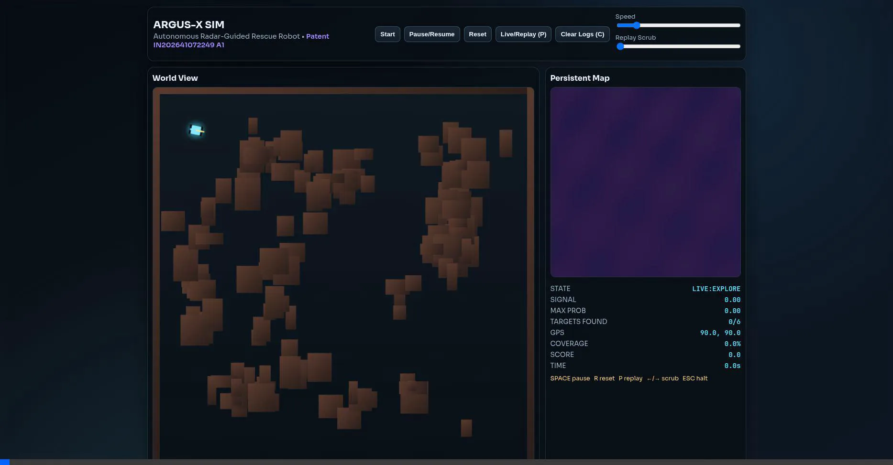
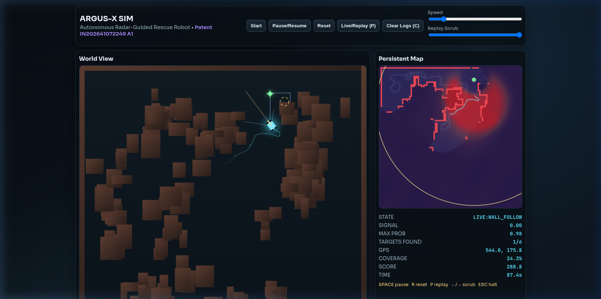
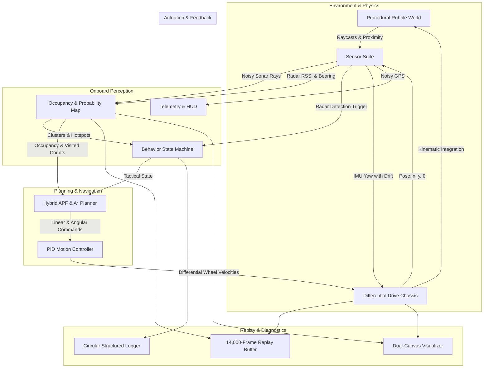

<div align="center">

# 🛰️ ARGUS-X SIM
### Autonomous Radar-Centric Search & Rescue Robot Simulation

[](LICENSE)
[](docs/PATENT.md)
[](index.html)
[](src/)
[](package.json)
[](#)
[](.github/workflows/ci.yml)

<p align="center">
  <b>A physically grounded, zero-cheat simulation of an autonomous ground rover navigating collapsed disaster rubble in GPS-denied and vision-obscured environments.</b><br>
  <i>Authored and invented by <b>Garv Arora</b> under the academic guidance of <b>Prof. Padma Priya R</b> (Vellore Institute of Technology).</i><br>
  <i>Protected under Indian Patent Application <b>IN202641072249 A1</b> (Government of India Patent Registry).</i>
</p>

[Quick Start](#-quick-start) •
[Patent IP](#-indian-patent-publication--intellectual-property) •
[System Architecture](#-system-architecture) •
[Sensor Suite](#-sensor-suite--hardware-realism) •
[Algorithms](#-algorithmic-foundations) •
[Controls](#-interactive-controls--hotkeys) •
[Documentation](#-documentation-index)

---

</div>

## ⚖️ Indian Patent Publication & Intellectual Property

This repository contains the **original simulation codebase, robotics algorithms, and experimental validation framework** developed by **Garv Arora** (under the academic guidance of **Prof. Padma Priya R** at **Vellore Institute of Technology**). This research provided the empirical reduction to practice and simulation results on which **Indian Patent Application IN202641072249 A1** was filed and published in the **Indian Patent Registry (Intellectual Property Office, Government of India)**:

| Field | Official Registry Details |
| :--- | :--- |
| **Title of Invention** | **Autonomous radar-guided survivor detection and navigation system** |
| **Publication Number** | **IN202641072249 A1** |
| **Application Number** | **202641072249** |
| **Date of Filing** | **10 June 2026** (10-06-2026) |
| **Date of Publication** | **19 June 2026** (19-06-2026) |
| **Journal Number** | **25/2026** |
| **International Classification (IPC)** | **G05D 1/02, G01C 21/16, G01S 13/931, G01S 13/86, G01S 15/931** |
| **Applicant** | **Vellore Institute of Technology** (Katpadi, Vellore, Tamil Nadu, India - 632014) |
| **Lead Inventor** | **Garv Arora** (System Architect & Software Author) |
| **Academic Guidance / Faculty Advisor** | **Prof. Padma Priya R** (Vellore Institute of Technology) |
| **Authorized Agent** | **Kuldeep Singh** (Indian Patent Agent Regn No. IN/PA-4358) |
| **Complete Reference** | Detailed patent claims (Claims 1–10) and hardware mappings are documented in [**`docs/PATENT.md`**](docs/PATENT.md). |

---

## 📌 Executive Overview

In disaster environments—such as collapsed concrete structures, active industrial fires, collapsed mine tunnels, and subterranean rubble voids—standard autonomous robotics stacks fail catastrophically:
- **LiDAR** suffers complete optical failure due to dense airborne particulates, steam, smoke, and reflective dust scatter.
- **RGB & Depth Cameras** are rendered useless by zero-lux conditions and physical occlusion.
- **GPS** is entirely blocked by reinforced concrete slabs and earth.

**ARGUS-X** is an autonomous search-and-rescue rover platform engineered around **24 GHz mmWave FMCW (Frequency-Modulated Continuous-Wave) radar**. Unlike optical sensors, millimeter-wave radio waves penetrate dust, smoke, and non-metallic debris, capturing micro-Doppler chest displacements ($0.5\text{--}5\text{ mm}$) generated by human respiration.

This simulation models the autonomous navigation, mapping, target identification, and recovery stack with **strict hardware realism**. The robot operates **without global map knowledge, without LiDAR, without vision, and without perfect localization**.

---

## 🎥 Live Simulation Demonstration

Below is a live demonstration recording of the **ARGUS-X** autonomous search-and-rescue rover navigating disaster rubble, executing ultrasonic obstacle contouring, emitting 24 GHz FMCW radar pulses, and generating real-time survivor probability heatmaps:

<div align="center">
  
  <br>
  
  <p><i>Real-time dual-viewport interface showing physical debris world (left), onboard 4-tier probability heatmap (right), HUD telemetry, and structured serial logs.</i></p>
</div>

---

## ⚡ Core Capabilities

- **Realistic 24 GHz mmWave Radar Modeling**: Simulates path-loss exponential attenuation, human respiration phase modulation ($0.14\text{--}0.32\text{ Hz}$), directional beam divergence ($171^\circ$ FOV), hardware transport latency ($240\text{ ms}$), sensor noise, and false-positive spikes.
- **Triple-Acoustic Sonar Array**: Front and $\pm 45^\circ$ lateral ultrasonic transducers provide local obstacle boundary detection with Gaussian distance noise and beam jitter.
- **Persistent Bayesian Probability Grid**: $100 \times 100$ spatial uncertainty grid with mean-reverting ambient noise priors, directional beam projection, and 5-tap separable 2D Gaussian diffusion.
- **8-Connected Spatial Clustering**: Groups contiguous high-likelihood probability zones into actionable survivor target centroids with dynamic non-maximum suppression.
- **Hybrid Navigation Engine**: Combines continuous **Artificial Potential Fields (APF)** with momentum vector preservation, **Anti-Revisit Frontier A\* Search**, and automatic **boxed-trap escape recovery maneuvers**.
- **5-Phase Behavioral Finite State Machine**: Dynamic tactical transitions across `EXPLORE`, `WALL_FOLLOW`, `TRACK`, `CONFIRM`, and `REPLAY`.
- **Deterministic Replay & Time-Scrubbing**: High-capacity ring buffer capturing full vehicle kinematics, raycast states, and deep-cloned binary grid snapshots up to 14,000 frames ($>18\text{ minutes}$ of real-time mission scrub).
- **Dual Cyber-Tactical Viewports**: Simultaneous real-time rendering of physical world space and the robot's onboard internal probability/occupancy map.

---

## 📐 System Architecture

ARGUS-X follows a strictly decoupled, unidirectional perception-cognition-actuation data pipeline:



---

## 🛰️ Sensor Suite & Hardware Realism (Patent System 10 & Chassis 100)

All sensors simulate physical constraints, transmission latencies, and real-world noise parameters matching **Indian Patent IN202641072249 A1**:

| Component & Numeral | Modeled Part | Physical Equivalent | Update Rate | Patent Specifications & Realism Characteristics |
| :--- | :--- | :--- | :--- | :--- |
| **Radar Sensor (110)** | Millimeter-Wave FMCW | Hi-Link HLK-LD2410C ($24\text{ GHz}$) | $60\text{ Hz}$ / $10\text{ Hz}$ Loop | Detects presence & respiration micro-motion through walls/rubble non-line-of-sight. $P_d \approx 0.85$, $P_{fa} \approx 0.05$. Moving target range $\approx 0.30\text{ m}$, static target range $\approx 0.72\text{ m}$, $171^\circ$ FOV, exponential distance attenuation. |
| **Ultrasonic Sensors (120)** | 3-Transducer Sonar Array | 3x HC-SR04 / RCWL-1601 | $60\text{ Hz}$ | Front ($0^\circ$), Left ($+45^\circ$), Right ($-45^\circ$) for multi-directional obstacle detection & right-hand wall-following. Range $2\text{--}400\text{ cm}$ with beam jitter ($\pm 0.6^\circ$) and Gaussian noise ($\pm 2.4\text{ px}$). |
| **Inertial Measurement (130)** | MEMS 6-DoF IMU | InvenSense MPU-6050 | $60\text{ Hz}$ | Mounted adjacent to radar sensor 110 for heading-radar angle synchronization. Continuous dead-reckoning heading estimation with random-walk drift ($\pm 0.015\text{ rad}$). |
| **Processing Unit (140)** | Embedded MCU Platform | ESP32 Dual-Core ($240\text{ MHz}$) | $10\text{ Hz}$ Loop | Dual-core processing under $200\text{ KB}$ RAM constraints; **zero cloud connectivity dependency**, executing all perception, mapping, and planning on-chassis. |
| **Drive Mechanism (150)** | Differential Drive Drivetrain | 12V Metal DC Gearmotors + L298N | $60\text{ Hz}$ | Differential drive with lower-chassis wheels. Velocity smoothing ($\alpha = 0.78$), max linear speed $78\text{ px/s}$, max angular velocity $3.4\text{ rad/s}$. |
| **GPS Module** | UART GNSS Receiver | NMEA 0183 standard over UART | Event-driven | Outputs latitude, longitude, and timestamp strictly upon survivor confirmation in Logging State; isolated from exploration navigation. |

---

## 🧠 Algorithmic Foundations (Patent Claims 1–10)

### 1. Probabilistic Grid Map (200) & Confidence Laws (Claims 1 & 4)
The processing unit maintains a 2D spatial grid map (**200**) where each cell stores an associated survivor confidence score $C \in [0.0, 1.0]$:
- **Detection Increment**: When radar returns associate a detection with cell $(x, y)$, confidence increases quantitatively:
  $$C = \min\left(1.0, \; C + 0.12 \times r\right)$$
  where $r$ represents the reliability factor (signal strength, consistency, SNR).
- **Time-Based Decay**: In the absence of subsequent detections, confidence decays over elapsed time:
  $$C = \max\left(0, \; C - \beta \times \Delta t\right)$$
  where $\beta$ is the decay value and $\Delta t$ is the elapsed time interval, ensuring stale or transient detections do not persist.
- **Four-Tier Heatmap Shading Scale**:
  - $0.00 \le C < 0.25$: Dotted / light shading (low confidence)
  - $0.25 \le C < 0.50$: Cross-hatched shading
  - $0.50 \le C < 0.75$: Diagonal line shading
  - $0.75 \le C \le 1.00$: Dark / black shading (high confidence)
  - Peak survivor breathing locations marked with distinctive indicators (pink markers).

### 2. Threshold-Driven State Machine & Directional Sweeping (Claims 2, 3 & 10)
Robot behavior is governed by a state machine operating without SLAM, cameras, or LiDAR (Claim 6):
1. **Exploration State**: Right-hand wall-following rule using front, left, and right ultrasonic distance measurements and IMU dead reckoning.
2. **Confirmation State**: Triggered when a cell confidence score exceeds the first threshold ($C \ge 0.72$). Exploration pauses, and the chassis executes a directional sweep across discrete angles relative to IMU heading:
   $$\Theta \in \{-90^\circ, -60^\circ, -45^\circ, -30^\circ, -15^\circ, 0^\circ, +15^\circ, +30^\circ, +45^\circ, +60^\circ, +90^\circ, 180^\circ\}$$
   or full $360^\circ$ rotation, combining multi-angle radar returns with IMU heading for triangulation.
3. **Logging State**: Triggered when confidence remains above the second threshold during sweep; records confirmed survivor coordinates with UART GPS NMEA data and grid coordinates, then resumes exploration.

### 3. Candidate Survivor Grouping & Aggregate Priority Ranking (Claim 8)
- Grouping neighbouring cells exceeding the detection threshold into contiguous target clusters.
- Computing aggregate confidence scores ($C_{\text{aggregate}}$) via weighted sum or average across cluster cells.
- Generating a rescue priority ranking table sorted by aggregate confidence to direct emergency teams.

### 4. Artificial Potential Fields (APF) & Trap Recovery
Continuous local steering integrates goal attraction, radar vital homing, obstacle repulsion, and momentum continuity:
$$\vec{F}_{\text{net}} = w_g \vec{F}_{\text{goal}} + w_r \vec{F}_{\text{radar}} + w_{\text{rep}} \vec{F}_{\text{rep}} + w_m \vec{F}_{\text{mom}}$$
- **Obstacle Repulsion ($\vec{F}_{\text{rep}}$)**: Quadratic distance decay across the ultrasonic array:
  $$\vec{F}_{\text{rep}} = \sum_{i} \left(1 - \frac{d_i}{R_{\text{rep}}}\right)^2 \hat{u}_{\text{away}}, \quad d_i < R_{\text{rep}} = 84\text{ px}$$
- **Anti-Revisit Frontier A\* Search**: Graph edge cost penalized by visit count ($\text{Cost}(u \to v) = 1 + 4.2 \times \text{Visits}(v)$) with temporary virtual obstacles for recent cells.
- **Boxed-Trap Recovery**: Automated reverse crawl ($v = -20\text{ px/s}, 0.28\text{ s}$) followed by pivot clearance ($\omega = \pm 2.0\text{ rad/s}, 0.48\text{ s}$).

---

## 🎮 Interactive Controls & Hotkeys

| Action | Control Button | Keyboard Shortcut | Functionality |
| :--- | :--- | :---: | :--- |
| **Start** | `Start` | — | Initiates autonomous mission execution. |
| **Pause / Resume** | `Pause/Resume` | <kbd>SPACE</kbd> | Freezes or unfreezes simulation physics and clocks. |
| **Reset** | `Reset` | <kbd>R</kbd> | Regenerates world rubble, spawns new survivors, and resets maps. |
| **Toggle Replay** | `Live/Replay (P)` | <kbd>P</kbd> | Toggles between LIVE simulation and historical REPLAY mode. |
| **Scrub Replay** | `Replay Scrub Slider` | <kbd>←</kbd> / <kbd>→</kbd> | Steps or scrubs through recorded timeline frames. |
| **Clear Logs** | `Clear Logs (C)` | <kbd>C</kbd> | Purges the structured telemetry logging terminal. |
| **Emergency Halt**| — | <kbd>ESC</kbd> | Immediately pauses simulation execution. |
| **Simulation Speed**| `Speed Slider` | — | Scales execution time multiplier ($0.5\times$ to $4.0\times$). |

---

## 🚀 Quick Start

ARGUS-X is built with native ES6 modules and requires **zero external build steps or node packages** to run.

### Option 1: Python HTTP Server (Recommended)
```bash
# Clone the repository
git clone https://github.com/gaminization/ARGUS-SIM.git
cd ARGUS-SIM

# Start static file server
python3 -m http.server 8080
```
Open **`http://localhost:8080`** in any modern web browser.

### Option 2: Node.js / npx
```bash
# Using npx serve
npx serve .
```

### Option 3: VS Code Live Server
1. Open the project folder in **VS Code**.
2. Right-click [`index.html`](file:///home/gaminizer/Projects/ARGUS-SIM/index.html) and select **"Open with Live Server"**.

### Code Validation
To verify all JavaScript modules for syntax and integrity:
```bash
npm run check
```

---

## 📊 Telemetry & HUD Reference

The right-hand control card provides real-time mission telemetry:

| HUD Metric | Description |
| :--- | :--- |
| **STATE** | Current operational mode and behavior state (`LIVE:EXPLORE`, `LIVE:TRACK`, `REPLAY`, etc.). |
| **SIGNAL** | Instantaneous normalized radar RSSI from detected respiratory micro-motion ($0.00\text{--}1.00$). |
| **MAX PROB** | Peak survivor probability density currently registered across the entire $100 \times 100$ map grid. |
| **TARGETS FOUND** | Number of victims confirmed vs total trapped survivors in the arena (e.g., `4/6`). |
| **GPS** | Degraded simulated GPS coordinate $(x, y)$ with injected Gaussian noise. |
| **COVERAGE** | Percentage of navigable arena area successfully explored and mapped. |
| **SCORE** | Real-time composite mission efficiency score. |
| **TIME** | Total elapsed mission time in seconds. |

### Mission Scoring Formula
$$\text{Score} = \max\left(0, \; 350 \times N_{\text{survivors}} - 1.2 \times t_{\text{elapsed}} + 180 \times \text{Coverage}\right)$$

---

## 📂 Repository Structure

```
ARGUS-SIM/
├── .github/
│   ├── ISSUE_TEMPLATE/
│   │   ├── bug_report.md       # Standardized bug reporting form
│   │   └── feature_request.md  # Enhancement submission form
│   ├── pull_request_template.md# Pull request checklist
│   └── workflows/
│       └── ci.yml              # GitHub Actions CI syntax verification
├── docs/
│   ├── PATENT.md               # Complete Indian Patent IN202641072249 A1 specification & claims
│   ├── ARCHITECTURE.md         # Detailed subsystem architecture & data pipelines
│   ├── ALGORITHMS.md           # Mathematical breakdown of APF, A*, and mapping
│   ├── HARDWARE_SPEC.md        # Physical robot BOM, electrical wiring, & sim-to-real
│   └── API.md                  # Comprehensive class, method, & parameter reference
├── src/
│   ├── config.js               # Central simulation constants, tuning gains, weights
│   ├── environment.js          # Procedural rubble world & survivor generator
│   ├── logger.js               # Ring-buffered telemetry logger
│   ├── main.js                 # Application lifecycle, UI event loop, & scoring
│   ├── mapping.js              # Occupancy grid & Bayesian probability density map
│   ├── navigation.js           # APF steering, frontier A* search, & trap recovery
│   ├── renderer.js             # Dual-viewport HTML5 Canvas 2D visualizer
│   ├── replay.js               # 14,000-frame deterministic replay scrubber
│   ├── robot.js                # Differential drive kinematics & chassis momentum
│   ├── sensors.js              # LD2410C radar, ultrasonic array, IMU, GPS models
│   ├── stateMachine.js         # 5-phase behavioral finite state machine
│   └── utils.js                # Vector arithmetic, Mulberry32 PRNG, spatial tools
├── .gitignore                  # Git ignore rules for web, OS, and editors
├── CITATION.cff                # Academic & patent citation metadata
├── CONTRIBUTING.md             # Contribution philosophy and PR standards
├── favicon.svg                 # Application vector icon
├── index.html                  # Cyber-tactical dashboard layout
├── LICENSE                     # MIT Open Source License
├── package.json                # Project scripts, metadata, and keywords
└── styles.css                  # Modern glassmorphism UI styling
```

---

## 📚 Documentation Index

For deeper technical study and hardware implementation, consult the dedicated documentation suite in [`docs/`](docs/):

- ⚖️ [**Indian Patent Specification (`docs/PATENT.md`)**](docs/PATENT.md): Official IP details, Form-2 claims 1–10, reference numerals, and legal registry publication metadata (**IN202641072249 A1**).
- 🏛️ [**System Architecture (`docs/ARCHITECTURE.md`)**](docs/ARCHITECTURE.md): Deep-dive into execution loops, data pipelines, sub-stepping, and memory allocation.
- 🧮 [**Algorithmic Foundations (`docs/ALGORITHMS.md`)**](docs/ALGORITHMS.md): Mathematical derivations of APF equations, Gaussian diffusion, and anti-revisit costs.
- 🤖 [**Hardware Specification & Sim-to-Real (`docs/HARDWARE_SPEC.md`)**](docs/HARDWARE_SPEC.md): Bill of materials (BOM), sensor wiring schematics, and UART protocol frames for physical robot construction.
- 📖 [**Module API Reference (`docs/API.md`)**](docs/API.md): Detailed parameter and method documentation for all core classes.
- 🤝 [**Contributing Guide (`CONTRIBUTING.md`)**](CONTRIBUTING.md): Workflow guidelines, coding style, and PR verification standards.

---

## 📄 License & Citation

This project is open-source software licensed under the [MIT License](LICENSE).

If you use this system or software in research, academic work, or technical benchmarking, please cite using [`CITATION.cff`](CITATION.cff) or the following citations:

### Indian Patent Citation
```bibtex
@patent{in202641072249,
  title     = {Autonomous radar-guided survivor detection and navigation system},
  author    = {Arora, Garv and Padma Priya, R},
  number    = {IN202641072249 A1},
  type      = {Patent Application},
  nationality = {Indian},
  institution = {Indian Patent Office},
  assignee  = {Vellore Institute of Technology},
  day       = {10},
  month     = {jun},
  year      = {2026},
  dayfiled  = {10},
  monthfiled= {jun},
  yearfiled = {2026},
  note      = {Invented by Garv Arora under the academic guidance of Prof. Padma Priya R at Vellore Institute of Technology. Published in Indian Patent Journal No. 25/2026 on 19-06-2026. IPC: G05D 1/02, G01C 21/16, G01S 13/931, G01S 13/86, G01S 15/931}
}
```

### Software Citation
```bibtex
@software{argus_sim_2026,
  author    = {Arora, Garv},
  title     = {ARGUS-X: Autonomous Radar-Centric Search & Rescue Robot Simulation},
  url       = {https://github.com/gaminization/ARGUS-SIM},
  year      = {2026},
  note      = {Original simulation codebase and algorithmic foundation authored by Garv Arora (guided by Prof. Padma Priya R) for Indian Patent IN202641072249 A1}
}
```
