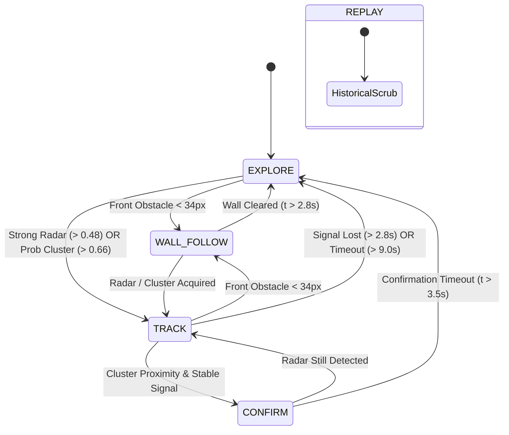

# ARGUS-SIM System Architecture

This document outlines the software architecture, data pipelines, module interactions, and execution lifecycle of the **ARGUS-X** autonomous search-and-rescue simulation.

> **Intellectual Property Notice**: This document details the **original robotics system architecture and simulation platform created by Garv Arora** (under the academic guidance of **Prof. Padma Priya R** at **Vellore Institute of Technology**). This software and simulation framework served as the foundational reduction to practice and experimental basis for **Indian Patent Application IN202641072249 A1** (*"Autonomous radar-guided survivor detection and navigation system"*), filed on 10 June 2026 and published on 19 June 2026.

---

## 1. High-Level System Architecture (Patent System 10)

ARGUS-X is designed as a modular, decoupled autonomous robotics simulation built purely on modern web standards (ES6 modules and HTML5 Canvas 2D). It models an autonomous ground vehicle (AGV) deployed in collapsed structures or subterranean voids where optical vision, LiDAR, and GPS fail catastrophically:
- **LiDAR** fails due to severe airborne dust and particulate backscatter.
- **Cameras** fail due to zero-lux conditions and non-line-of-sight rubble obstruction.
- **GPS** is attenuated by reinforced concrete slabs and earth.

To solve this, the architecture designed by Garv Arora—which forms the basis of **System (10)** in Indian Patent IN202641072249 A1—combines a 24 GHz mmWave radar module (`110`), a 3-transducer ultrasonic sonar array (`120`), and an inertial measurement unit (`130`) coupled to an embedded processing unit (`140`) running a probabilistic confidence grid (`200`) and a threshold-driven state machine—**completely free from SLAM, cameras, or LiDAR (Claim 6)**.

```mermaid
flowchart TD
    subgraph Physical Chassis 100 & Environment
        ENV[Procedural Rubble Environment] -->|Debris Geometry & Raycast| SENS[Sensor Suite]
        ROBOT[Chassis Kinematics & Drive 150] -->|True Pose x, y, θ| SENS
    end

    subgraph Perception & State Estimation (140)
        SENS -->|120: Ultrasonic Distances Front, ±45°| MAP[200: Probabilistic Grid Map]
        SENS -->|110: Radar Returns & Breathing Doppler| MAP
        SENS -->|110: Detection Trigger Threshold| FSM[Behavior State Machine]
        SENS -->|130: IMU Heading with Drift| ROBOT
        SENS -->|NMEA UART GPS Telemetry| HUD[HUD & Telemetry]
        MAP -->|Occupancy & Visited Arrays| NAV[Navigation Engine]
        MAP -->|Survivor Clusters & Centroids| FSM
        MAP -->|Target Hotspots| NAV
    end

    subgraph Decision & Planning (140)
        FSM -->|Tactical State: Explore / Track / Confirm| NAV
        NAV -->|Repulsion, Goal, Radar APF| CTRL[PID Motion Controller]
        NAV -->|Frontier A* Path| CTRL
    end

    subgraph Actuation & Feedback (150)
        CTRL -->|Differential Motor PWM Commands| ROBOT
        ROBOT -->|Integrated Velocity| ENV
    end

    subgraph Diagnostics & Replay
        ROBOT --> LOG[Circular Telemetry Logger]
        MAP --> LOG
        FSM --> LOG
        ROBOT --> REP[14,000-Frame Replay Buffer]
        MAP --> REP
        ENV --> RENDER[Dual-Canvas Renderer]
        MAP --> RENDER
    end
```

---

## 2. Execution Pipeline & Time-Stepping

The simulation runs on a browser `requestAnimationFrame` loop with strict delta-time clamping to prevent tunneling, numerical instability, or state explosion when browser tabs are unfocused.

```javascript
loop(ts) {
  const dt = (ts - this.lastTs) / 1000;
  this.lastTs = ts;

  if (this.liveMode === "REPLAY") {
    if (!this.paused) {
      this.replay.stepCursor(1);
      this.renderReplayFrame();
    }
    return;
  }

  if (!this.paused) {
    this.step(dt);
  } else {
    this.render();
  }
}
```

### Time Clamping and Sub-stepping
In `step(dtRaw)`:
- Raw delta time is scaled by the user speed multiplier: `dt = clamp(dtRaw * this.speed, 0, 0.04)`.
- The maximum integration step is strictly capped at $40\text{ ms}$ ($25\text{ Hz}$ minimum physics resolution), preserving numerical integrity under low frame rates.

---

## 3. Subsystem Breakdown

### 3.1. Procedural Environment (`src/environment.js`)
- **Map Dimensions**: $800 \times 800\text{ px}$ continuous Cartesian plane.
- **Perimeter Bounds**: Enclosed by fixed boundary colliders.
- **Rubble & Obstacle Synthesis**: Generates clustered rectangular debris packs (mimicking fallen masonry, broken slabs, and partition walls) with randomized widths ($18\text{--}62\text{ px}$) and heights ($18\text{--}70\text{ px}$).
- **Clear Zones**: Strategically carves circular open chambers to establish non-trivial navigational topology with narrow passageways.
- **Survivors**: Deploys trapped targets outside clearance zones, assigning each an organic breathing frequency ($f_b \in [0.14, 0.32]\text{ Hz}$) and initial phase.

### 3.2. Local Perception Suite (`src/sensors.js`)
The sensor suite strictly models local, hardware-realistic constraints:
- **Triple Ultrasonic Array**:
  - Front ($0^\circ$), Left ($+45^\circ$), Right ($-45^\circ$).
  - Maximum range: $120\text{ px}$.
  - Raycasted against physical obstacles, injected with angular jitter ($\pm 0.6^\circ$) and Gaussian distance noise ($\pm 2.4\text{ px}$).
- **mmWave Vital Radar (LD2410C equivalent)**:
  - Range: $180\text{ px}$, Field-of-View: $171^\circ$ ($\approx 0.95\pi$).
  - Path-loss attenuation: Gaussian exponential decay $e^{-d^2 / (2 \cdot 70^2)}$.
  - Modulated by survivor breathing cycles: $S(t) = 0.6 + 0.4 \sin(2\pi f_b t + \phi)$.
  - Incorporates transport delay queue ($\tau = 240\text{ ms}$ latency), signal noise ($\pm 0.06$), direction noise ($\pm 0.18\text{ rad}$), and random false positive events ($P = 0.012$).
- **Inertial Measurement Unit (MPU-6050 equivalent)**:
  - Measures orientation yaw with continuous noise injection ($\pm 0.015\text{ rad}$).
- **Degraded GPS**:
  - Sampled at low frequency ($2\text{ Hz}$) with high Gaussian position noise ($\pm 4.5\text{ px}$).
  - Used strictly for telemetry and HUD diagnostics; **never used by the robot navigation or mapping pipelines**.

### 3.3. Persistent Mapping & Spatial Heatmap (`src/mapping.js`)
The environment is mapped onto an internal discrete grid of $100 \times 100$ cells ($8\text{ px}$ cell resolution):
- **`visited` (`Float32Array`)**: Records cumulative occupancy count per cell to calculate coverage and penalize path revisits.
- **`explored` (`Uint8Array`)**: Binary mask indicating cells cleared by raycasts or vehicle passage.
- **`obstacle` (`Uint8Array`)**: Marks verified obstacle hits detected at ultrasonic termination points.
- **`prob` (`Float32Array`)**: Spatial Bayesian probability density representing likelihood of survivor presence. Updated per Patent Claim 4:
  $$C = \min(1.0, \; C + 0.12 \times r), \quad \text{decay: } C = \max(0, \; C - \beta \times \Delta t)$$
- **`ambient` (`Float32Array`)**: Non-zero baseline spatial noise floor ensuring uncertainty never drops to an unrealistic zero prior.
- **Spatial Clustering (Claim 8)**: Evaluates cells with confidence exceeding threshold ($P \ge 0.56$), grouping contiguous regions via 8-connected flood-fill into weighted centroid clusters $(x, y, \text{confidence}, \text{size})$.

### 3.4. Behavioral State Machine (Patent Claim 2 Mapping)
The high-level state machine disclosed in **Indian Patent IN202641072249 A1** comprises three fundamental operational states: **Exploration State**, **Confirmation State**, and **Logging State**. In this simulation, these are implemented via a five-phase real-time tactical state machine:

| Patent State (Claim 2) | Simulation Mode | Operational Role | Transition Conditions |
| :--- | :--- | :--- | :--- |
| **Exploration State** | `EXPLORE` & `WALL_FOLLOW` | Systematic debris field coverage using right-hand wall-following via ultrasonic sensors (`120`) and heading estimation from IMU (`130`). | Transitions to Confirmation when radar confidence exceeds 1st threshold ($C \ge 0.72$). |
| **Confirmation State** | `TRACK` & `CONFIRM` | Halts exploration; executes multi-angle directional sweep across $[-90^\circ, \dots, +90^\circ, 180^\circ]$ and triangulation. | If confidence persists $\ge$ 2nd threshold $\to$ Logging; if signal lost $\to$ Exploration. |
| **Logging State** | Confirmation / Marker Output | Records target coordinates $(x, y)$, fetches GPS NMEA data, and updates rescue priority ranking. | Resumes Exploration to detect remaining victims. |



### 3.5. Periodic 10 Hz Control Loop (Patent Claim 9 & FIG. 3)
Per patent paragraph [0074] and FIG. 3, each iteration of the primary control cycle executes:
1. **Radar Ingestion & Range-Doppler Cell Mapping**: Receives micro-motion respiration reflections from radar sensor 110.
2. **Confidence Grid Update**: Increases cell confidence ($C + 0.12 \times r$) or decays unconfirmed cells ($C - \beta \Delta t$).
3. **Ultrasonic Range Reading**: Reads front, left, and right distances from sensor trio 120.
4. **Motion Command Generation**: Synthesizes linear and angular velocities for differential drive 150.

### 3.6. Hybrid Navigation & Motion Control (`src/navigation.js` & `src/robot.js`)
Combines reactive and deliberative path planning:
1. **Artificial Potential Fields (APF)**:
   $$\vec{F}_{\text{net}} = w_g \vec{F}_{\text{goal}} + w_r \vec{F}_{\text{radar}} + w_{\text{rep}} \vec{F}_{\text{repulsion}} + w_m \vec{F}_{\text{momentum}}$$
2. **A\* Frontier Planner**:
   - Discovers nearest unvisited frontier cells when in `EXPLORE` mode.
   - Plans Euclidean grid paths with heavy revisit penalties ($4.2 \times \text{visits}$) to guarantee exhaustive coverage without circular loops.
3. **Trapped Recovery Sequence**:
   - Detects boxed states when multiple ultrasonic sensors read $< 24\text{ px}$ and velocity drops.
   - Triggers a 2-phase reverse-and-pivot escape sequence before re-planning.
4. **PID Steering & Kinematics**:
   - Continuous heading error $\theta_{\text{err}} = \text{atan2}(F_y, F_x) - \theta_{\text{robot}}$.
   - Closed-loop PID control ($K_p = 2.45, K_i = 0.20, K_d = 0.42$) generates differential steering commands.
   - Smoothing filters simulate wheel inertia and chassis mass.

---

## 4. Replay & Telemetry Engine (`src/replay.js` & `src/logger.js`)

- **Ring Buffer Storage**: Captures complete system state snapshots at $12.5\text{ Hz}$ ($80\text{ ms}$ intervals) up to 14,000 frames (over 18 minutes of continuous simulation).
- **Snapshot Contents**:
  - Full robot continuous state $(x, y, \theta, \vec{v}, \vec{\omega})$.
  - Ultrasonic ray states, radar RSSI, and direction.
  - Deep-copied binary snapshots of `visited`, `explored`, `obstacle`, and `prob` grid arrays.
  - Active trail breadcrumbs and survivor confirmation sets.
- **Scrubbing**: Bidirectional interactive scrubbing slider with instant visual restoration and pause/resume capability.
- **Structured Logger**: High-throughput circular ring buffer maintaining the last 260 formatted log entries across `NAV`, `RADAR`, `MAP`, `CTRL`, and `STATE` telemetry channels.
