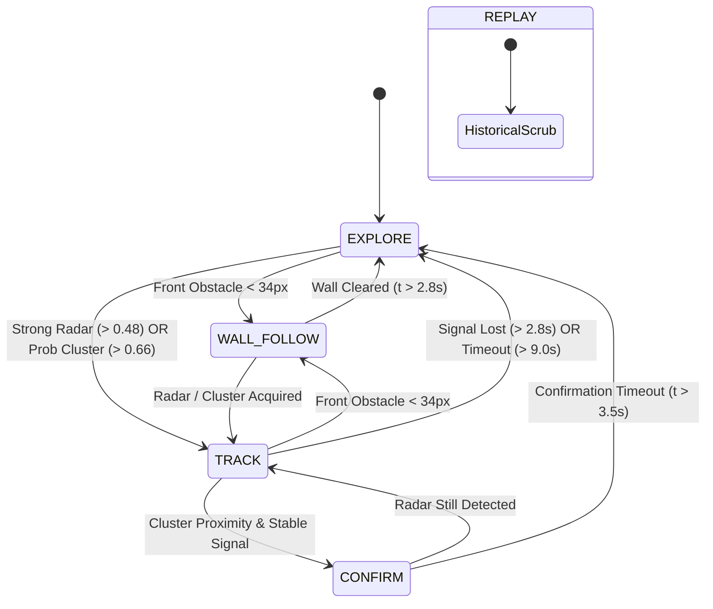

# ARGUS-SIM System Architecture

This document outlines the software architecture, data pipelines, module interactions, and execution lifecycle of the **ARGUS-X** autonomous search-and-rescue simulation.

---

## 1. High-Level System Architecture

ARGUS-X is designed as a modular, decoupled autonomous robotics simulation built purely on modern web standards (ES6 modules and HTML5 Canvas 2D). It models an autonomous ground vehicle (AGV) deployed in collapsed structures or subterranean voids where optical vision and LiDAR sensors fail due to airborne particulates (smoke, dust, mist).

```mermaid
flowchart TD
    subgraph Physics & World
        ENV[Procedural Environment] -->|Ground Truth Geometry| SENS[Sensor Suite]
        ROBOT[Robot Chassis Kinematics] -->|True Pose (x, y, θ)| SENS
    end

    subgraph Perception & State Estimation
        SENS -->|Noisy Sonar Rays| MAP[Mapping System]
        SENS -->|Radar RSSI + Direction| MAP
        SENS -->|Radar Detection Event| FSM[Behavior State Machine]
        SENS -->|Gyro Yaw & Drift| ROBOT
        SENS -->|Noisy GPS (Telemetry Only)| HUD[HUD & Telemetry]
        MAP -->|Occupancy & Visited Grids| NAV[Navigation Engine]
        MAP -->|Survivor Clusters| FSM
        MAP -->|Target Hotspots| NAV
    end

    subgraph Decision & Planning
        FSM -->|Current State| NAV
        NAV -->|Repulsion, Goal, Radar APF| CTRL[PID Motion Controller]
        NAV -->|Frontier A* Path| CTRL
    end

    subgraph Actuation & Feedback
        CTRL -->|Linear & Angular Commands| ROBOT
        ROBOT -->|Integrated Velocity| ENV
    end

    subgraph Diagnostics & Replay
        ROBOT --> LOG[Logger & HUD]
        MAP --> LOG
        FSM --> LOG
        ROBOT --> REP[Replay Ring Buffer]
        MAP --> REP
        ENV --> RENDER[Dual-Canvas Renderer]
        MAP --> RENDER
    end
```

---

## 2. Execution Pipeline & Time-Stepping

The simulation runs on a browser `requestAnimationFrame` loop with strict delta-time clamping to prevent tunneling, numerical instability, or state explosion when browser tabs are unfocused.

```javascript
loop(ts) {
  const dt = (ts - this.lastTs) / 1000;
  this.lastTs = ts;

  if (this.liveMode === "REPLAY") {
    if (!this.paused) {
      this.replay.stepCursor(1);
      this.renderReplayFrame();
    }
    return;
  }

  if (!this.paused) {
    this.step(dt);
  } else {
    this.render();
  }
}
```

### Time Clamping and Sub-stepping
In `step(dtRaw)`:
- Raw delta time is scaled by the user speed multiplier: `dt = clamp(dtRaw * this.speed, 0, 0.04)`.
- The maximum integration step is strictly capped at $40\text{ ms}$ ($25\text{ Hz}$ minimum physics resolution), preserving numerical integrity under low frame rates.

---

## 3. Subsystem Breakdown

### 3.1. Procedural Environment (`src/environment.js`)
- **Map Dimensions**: $800 \times 800\text{ px}$ continuous Cartesian plane.
- **Perimeter Bounds**: Enclosed by fixed boundary colliders.
- **Rubble & Obstacle Synthesis**: Generates clustered rectangular debris packs (mimicking fallen masonry, broken slabs, and partition walls) with randomized widths ($18\text{--}62\text{ px}$) and heights ($18\text{--}70\text{ px}$).
- **Clear Zones**: Strategically carves circular open chambers to establish non-trivial navigational topology with narrow passageways.
- **Survivors**: Deploys trapped targets outside clearance zones, assigning each an organic breathing frequency ($f_b \in [0.14, 0.32]\text{ Hz}$) and initial phase.

### 3.2. Local Perception Suite (`src/sensors.js`)
The sensor suite strictly models local, hardware-realistic constraints:
- **Triple Ultrasonic Array**:
  - Front ($0^\circ$), Left ($+45^\circ$), Right ($-45^\circ$).
  - Maximum range: $120\text{ px}$.
  - Raycasted against physical obstacles, injected with angular jitter ($\pm 0.6^\circ$) and Gaussian distance noise ($\pm 2.4\text{ px}$).
- **mmWave Vital Radar (LD2410C equivalent)**:
  - Range: $180\text{ px}$, Field-of-View: $171^\circ$ ($\approx 0.95\pi$).
  - Path-loss attenuation: Gaussian exponential decay $e^{-d^2 / (2 \cdot 70^2)}$.
  - Modulated by survivor breathing cycles: $S(t) = 0.6 + 0.4 \sin(2\pi f_b t + \phi)$.
  - Incorporates transport delay queue ($\tau = 240\text{ ms}$ latency), signal noise ($\pm 0.06$), direction noise ($\pm 0.18\text{ rad}$), and random false positive events ($P = 0.012$).
- **Inertial Measurement Unit (MPU-6050 equivalent)**:
  - Measures orientation yaw with continuous noise injection ($\pm 0.015\text{ rad}$).
- **Degraded GPS**:
  - Sampled at low frequency ($2\text{ Hz}$) with high Gaussian position noise ($\pm 4.5\text{ px}$).
  - Used strictly for telemetry and HUD diagnostics; **never used by the robot navigation or mapping pipelines**.

### 3.3. Persistent Mapping & Spatial Heatmap (`src/mapping.js`)
The environment is mapped onto an internal discrete grid of $100 \times 100$ cells ($8\text{ px}$ cell resolution):
- **`visited` (`Float32Array`)**: Records cumulative occupancy count per cell to calculate coverage and penalize path revisits.
- **`explored` (`Uint8Array`)**: Binary mask indicating cells cleared by raycasts or vehicle passage.
- **`obstacle` (`Uint8Array`)**: Marks verified obstacle hits detected at ultrasonic termination points.
- **`prob` (`Float32Array`)**: Spatial Bayesian probability density representing likelihood of survivor presence.
- **`ambient` (`Float32Array`)**: Non-zero baseline spatial noise floor ensuring uncertainty never drops to an unrealistic zero prior.
- **Spatial Clustering**: Evaluates cells with confidence exceeding $0.56$, grouping contiguous regions via 8-connected flood-fill into weighted centroid clusters $(x, y, \text{confidence}, \text{size})$.

### 3.4. Behavioral Finite State Machine (`src/stateMachine.js`)
Controls tactical mission autonomy via five distinct behavioral modes:



### 3.5. Hybrid Navigation & Motion Control (`src/navigation.js` & `src/robot.js`)
Combines reactive and deliberative path planning:
1. **Artificial Potential Fields (APF)**:
   $$\vec{F}_{\text{net}} = w_g \vec{F}_{\text{goal}} + w_r \vec{F}_{\text{radar}} + w_{\text{rep}} \vec{F}_{\text{repulsion}} + w_m \vec{F}_{\text{momentum}}$$
2. **A\* Frontier Planner**:
   - Discovers nearest unvisited frontier cells when in `EXPLORE` mode.
   - Plans Euclidean grid paths with heavy revisit penalties ($4.2 \times \text{visits}$) to guarantee exhaustive coverage without circular loops.
3. **Trapped Recovery Sequence**:
   - Detects boxed states when multiple ultrasonic sensors read $< 24\text{ px}$ and velocity drops.
   - Triggers a 2-phase reverse-and-pivot escape sequence before re-planning.
4. **PID Steering & Kinematics**:
   - Continuous heading error $\theta_{\text{err}} = \text{atan2}(F_y, F_x) - \theta_{\text{robot}}$.
   - Closed-loop PID control ($K_p = 2.45, K_i = 0.20, K_d = 0.42$) generates differential steering commands.
   - Smoothing filters simulate wheel inertia and chassis mass.

---

## 4. Replay & Telemetry Engine (`src/replay.js` & `src/logger.js`)

- **Ring Buffer Storage**: Captures complete system state snapshots at $12.5\text{ Hz}$ ($80\text{ ms}$ intervals) up to 14,000 frames (over 18 minutes of continuous simulation).
- **Snapshot Contents**:
  - Full robot continuous state $(x, y, \theta, \vec{v}, \vec{\omega})$.
  - Ultrasonic ray states, radar RSSI, and direction.
  - Deep-copied binary snapshots of `visited`, `explored`, `obstacle`, and `prob` grid arrays.
  - Active trail breadcrumbs and survivor confirmation sets.
- **Scrubbing**: Bidirectional interactive scrubbing slider with instant visual restoration and pause/resume capability.
- **Structured Logger**: High-throughput circular ring buffer maintaining the last 260 formatted log entries across `NAV`, `RADAR`, `MAP`, `CTRL`, and `STATE` telemetry channels.
