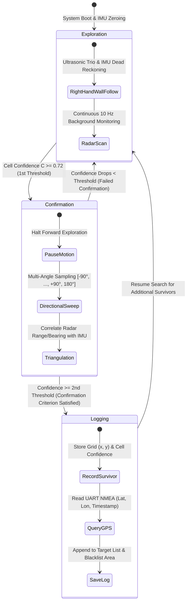

# Indian Patent Publication: Autonomous Radar-Guided Survivor Detection and Navigation System

## Official Intellectual Property Registry Data

| Parameter | Official Record |
| :--- | :--- |
| **Jurisdiction / Patent Office** | Intellectual Property Office, Government of India (IPO) |
| **Patent Application Number** | **202641072249** |
| **Publication Number** | **IN202641072249 A1** |
| **Date of Filing** | **10 June 2026** (10-06-2026) |
| **Date of Publication** | **19 June 2026** (19-06-2026) |
| **Journal Number** | **25/2026** |
| **Title of Invention** | **Autonomous radar-guided survivor detection and navigation system** |
| **International Patent Classification (IPC)** | **G05D 1/02, G01C 21/16, G01S 13/931, G01S 13/86, G01S 15/931** |
| **Applicant** | **Vellore Institute of Technology**<br>Tiruvalam Road, Katpadi, Vellore, Tamil Nadu, India - 632014 |
| **Lead Inventor & Creator** | **Garv Arora** (System Architect & Simulation Software Author) |
| **Faculty Guidance / Academic Advisor** | **Prof. Padma Priya R** (Professor, Vellore Institute of Technology) |
| **Authorized Patent Agent** | **Kuldeep Singh** (Indian Patent Agent Regn No. IN/PA-4358) |
| **Application Type** | Complete Specification (Form-2, Rule 13, Section 10, The Patents Act 1970) |

> **Development & Research Foundation**:  
> This codebase represents the **original simulation engine, algorithmic models, and robotics software developed by Garv Arora** (under the academic guidance of Prof. Padma Priya R at Vellore Institute of Technology). The simulation results, probability grid math, and autonomous navigation architectures implemented here formed the empirical reduction to practice upon which this Indian Patent Application was filed and published.

---

## 1. Abstract of the Invention

A system (**10**) for autonomous survivor detection and navigation in disaster rescue environments comprises a mobile robot chassis (**100**), a radar sensor (**110**) configured to detect presence and micro-motion signatures, ultrasonic sensors (**120**) configured to provide distance measurements for obstacle detection, and an inertial measurement unit (**130**) configured to track heading data for dead-reckoning navigation.

A processing unit (**140**) is coupled to the radar sensor (**110**), ultrasonic sensors (**120**), and inertial measurement unit (**130**), and maintains a grid map (**200**) comprising cells each having an associated confidence score. The processing unit (**140**) updates the confidence score based on radar detections, wherein the confidence score increases upon radar detection and decays over time absent further radar detections, and controls navigation based on the confidence scores and distance measurements. A drive mechanism (**150**) moves the mobile robot chassis (**100**) based on navigation commands from the processing unit (**140**).

---

## 2. Technical Motivation & Prior Art Inadequacies

Natural and man-made disasters (earthquakes, structural collapses, landslides, mine cave-ins, industrial explosions) trap living survivors beneath dense rubble and masonry voids where conventional robotics stacks fail:
1. **LiDAR Failure**: Dense airborne dust, particulate scattering, smoke, and moisture cause severe beam backscatter and false barriers.
2. **Vision / Camera Failure**: Zero-lux ambient light, thick smoke, and total non-line-of-sight occlusion render RGB and depth cameras useless.
3. **PIR & Thermal Limitations**: Passive infrared and thermal sensors only detect surface movement or significant temperature deltas; they cannot identify stationary, hypothermic, or unconscious victims shielded by concrete slabs.
4. **GPS Inaccessibility**: Subterranean voids and heavy reinforced concrete attenuate GNSS signals completely.
5. **SLAM Fragility**: Conventional visual or LiDAR-based Simultaneous Localization and Mapping (SLAM) requires high compute power and diverges in dust-filled, feature-poor disaster rubble.

The invention solves these limitations by utilizing **24 GHz millimeter-wave FMCW radar** capable of penetrating non-metallic rubble and smoke to capture microscopic chest wall displacements ($0.5\text{--}5.0\text{ mm}$) caused by human respiration, paired with an ultra-lightweight **ultrasonic wall-following and IMU dead-reckoning navigation architecture** that requires **no cameras, no LiDAR, and no SLAM**, operating entirely within the memory and compute budget of an embedded dual-core microcontroller (e.g., ESP32 constraints).

---

## 3. System Hardware Architecture (Reference Numerals)

```mermaid
graph TD
    subgraph Mobile Robot Chassis 100
        Power[Power Source: Li-ion / LiPo Pack]
        Drive[150: Differential Drive & L298N Driver]
        Processing[140: Processing Unit<br>Dual-Core 240 MHz, <200 KB RAM]
        IMU[130: MEMS IMU<br>Gyro, Accel, Mag]
        Radar[110: 24 GHz mmWave Radar<br>LD2410C FMCW Model]
        Ultrasonics[120: Ultrasonic Array<br>Front, Left, Right HC-SR04]
        GPS[GPS Module<br>UART NMEA Output]
    end

    subgraph Memory & Computation
        GridMap[200: Probabilistic Grid Map<br>Confidence Scores C in [0.0, 1.0]]
        FSM[Threshold-Driven State Machine<br>Exploration | Confirmation | Logging]
    end

    Radar -->|Micro-motion Respiration Returns| Processing
    Ultrasonics -->|Front / Left / Right Distances| Processing
    IMU -->|Dead-Reckoning Heading| Processing
    Processing -->|Confidence Updates & Decay| GridMap
    GridMap -->|Cluster & Peak Scores| FSM
    FSM --> Processing
    Processing -->|Navigation Control Commands| Drive
    Processing -->|On Confirmed Survivor: Log Lat/Lon/Time| GPS
```

### Component Details per Specification:
- **Mobile Robot Chassis (`100`)**: Structural base platform housing processing electronics, sensors, battery pack, and locomotion actuators.
- **Radar Sensor (`110`)**: Top-mounted 24 GHz millimeter-wave FMCW radar module modeled after the HLK-LD2410C with non-line-of-sight penetration. Detection characteristics:
  - Detection probability $P_d \approx 0.85$
  - False-positive rate $P_{fa} \approx 0.05$
  - Moving target sensitivity range $\approx 0.30\text{ m}$
  - Static target (respiration) sensitivity range $\approx 0.72\text{ m}$
  - Detects breathing patterns through rubble without direct line of sight.
- **Ultrasonic Sensors (`120`)**: Distributed trio comprising a front ultrasonic sensor ($0^\circ$), left ultrasonic sensor ($+45^\circ$ or lateral), and right ultrasonic sensor ($-45^\circ$ or lateral) modeled after HC-SR04 with a measurement range of $2\text{--}400\text{ cm}$.
- **Inertial Measurement Unit (`130`)**: Mounted adjacent to the radar sensor (`110`) to correlate robot heading with radar angular returns; comprises MEMS 3-axis gyroscopes, accelerometers, and magnetometers for dead reckoning.
- **Processing Unit (`140`)**: Embedded dual-core processor operating at $\approx 240\text{ MHz}$ with under $200\text{ KB}$ available RAM (modeled on ESP32 microcontroller architecture). Operates locally with **zero cloud connectivity dependency**.
- **Drive Mechanism (`150`)**: Lower-chassis differential drive locomotion powered by dual DC gearmotors driven by an L298N H-bridge controller.
- **GPS Module**: Coupled to processing unit over UART, outputting standard NMEA sentences (latitude, longitude, timestamp) logged strictly when a survivor is confirmed.
- **Power Source**: Lithium-ion or LiPo rechargeable battery situated beneath chassis base for low center of gravity.

---

## 4. Algorithmic Formulations (Patent Claims & Description)

### 4.1. Confidence Score Update Law
Each cell in the grid map (**200**) holds a confidence score $C \in [0.0, 1.0]$. When the radar sensor detects a micro-motion signature corresponding to cell coordinates:

$$C_{t} = \min\left(1.0, \; C_{t-1} + 0.12 \times r\right)$$

where $r$ is a detection reliability factor representing signal strength, consistency, or signal-to-noise ratio (SNR).

### 4.2. Time-Based Confidence Decay Law
In the absence of subsequent radar detections for a given cell, the score decays over time:

$$C_{t} = \max\left(0.0, \; C_{t-1} - \beta \times \Delta t\right)$$

where $\beta$ is the decay coefficient and $\Delta t$ is the elapsed time interval since the last update. This eliminates transient false positives while maintaining recent high-confidence candidate zones.

### 4.3. Four-Tier Heatmap Representation Scale
The probability grid visualizes survivor likelihood through a 4-tier standardized shading scale:

| Confidence Range | Shading Pattern | Probability Interpretation |
| :--- | :--- | :--- |
| **$0.00 \le C < 0.25$** | Dotted / Light Shading | Ambient background / Unlikely |
| **$0.25 \le C < 0.50$** | Cross-Hatched Shading | Low / Tentative Detection |
| **$0.50 \le C < 0.75$** | Diagonal Line Shading | Moderate / Developing Target |
| **$0.75 \le C \le 1.00$** | Dark / Solid Black Shading | High Confidence / Confirmed Target |

Peak survivor probability locations based on breathing pattern detection are indicated by distinct visual markers (e.g., pink indicators / target markers).

### 4.4. Fixed-Rate Periodic Control Loop (10 Hz)
Per patent paragraph [0038]–[0039] and **FIG. 3**, the processing unit executes a deterministic periodic loop at **$10\text{ Hz}$** ($100\text{ ms}$ period):
1. **Radar Ingestion**: Receive radar return data from radar sensor (`110`), perform range-Doppler processing and spatial cell mapping.
2. **Confidence Update**: Update confidence scores for cells across grid map (`200`) using increment and decay formulas.
3. **Obstacle Sensing**: Receive distance measurements from the front, left, and right ultrasonic sensors (`120`).
4. **Command Generation**: Compute velocity and heading commands for drive mechanism (`150`).

---

## 5. Threshold-Driven State Machine Architecture



### 5.1. Exploration State
- Autonomous navigation via **right-hand wall-following** utilizing front, left, and right ultrasonic range measurements.
- Heading estimation sustained via IMU dead reckoning.
- **Zero reliance on SLAM, cameras, or LiDAR**.
- Continuous radar reception at $10\text{ Hz}$.

### 5.2. Confirmation State
- **Trigger**: Activated when any cell in grid map (`200`) exceeds the **first threshold ($C \ge 0.72$)**.
- Rover halts exploration trajectory.
- Executes a **directional sweep** across discrete angular intervals relative to the current IMU heading:
  $$\Theta_{\text{sweep}} \in \{-90^\circ, -60^\circ, -45^\circ, -30^\circ, -15^\circ, 0^\circ, +15^\circ, +30^\circ, +45^\circ, +60^\circ, +90^\circ, 180^\circ\}$$
  or a full $360^\circ$ in-place rotation.
- Performs **triangulation** combining multi-angle radar returns with IMU heading data to isolate target coordinates.

### 5.3. Logging State
- **Trigger**: When the confidence score remains above the second threshold during the directional sweep.
- Records survivor position $(x, y)$, peak confidence, and fetches instantaneous GPS coordinates (latitude, longitude, timestamp) from UART NMEA output.
- Transitions back to Exploration State to continue sweeping the remaining debris field.

### 5.4. Spatial Clustering & Aggregate Priority Ranking
- Neighbouring high-confidence cells exceeding the detection threshold are grouped into candidate clusters.
- The system calculates an **aggregate confidence score** (sum, mean, or weighted combination) for each cluster:
  $$C_{\text{aggregate}} = \sum_{k \in \text{Cluster}} w_k C_k$$
- Generates a prioritized **ranking table**:
  | Rank ID | Candidate ID | Aggregate Confidence | Estimated Location $(x, y)$ | GPS Coordinates |
  | :---: | :---: | :---: | :---: | :---: |
  | #1 | Survivor-Alpha | $0.94$ | $(12.4\text{ m}, 8.2\text{ m})$ | $12.9716^\circ\text{ N}, 79.1588^\circ\text{ E}$ |
  | #2 | Survivor-Beta | $0.86$ | $(4.8\text{ m}, 15.6\text{ m})$ | $12.9719^\circ\text{ N}, 79.1592^\circ\text{ E}$ |

---

## 6. Official Patent Claims Mapping (Form-2, Claims 1–10)

| Claim | Claim Subject | Implementation in Codebase |
| :---: | :--- | :--- |
| **1** | **Independent System Claim**: Mobile robot chassis (100), radar sensor (110) detecting presence/micro-motion, plurality of ultrasonic sensors (120), IMU (130) tracking heading, processing unit (140) maintaining grid map (200) with confidence increment and decay, and drive mechanism (150). | `src/robot.js`, `src/sensors.js`, `src/mapping.js`, `src/navigation.js` in simulation; `argus_sensors`, `argus_mapping`, `argus_navigation`, `argus_description` in ROS 2. |
| **2** | **State Machine Claim**: State machine comprising Exploration (wall-following and dead-reckoning), Confirmation (directional sweep on $C > \text{threshold}_1$), and Logging (records location on $C > \text{threshold}_2$). | `src/stateMachine.js` (`EXPLORE`, `TRACK`, `CONFIRM`); `argus_navigation_node.py` FSM. |
| **3** | **State Transition Claim**: Transition from Exploration to Confirmation on first threshold, and Confirmation to Logging on confirmation criterion. | Verified in `test_navigation_logic.py`, `src/navigation.js`, and `stateMachine.js`. |
| **4** | **Confidence Score Formula Claim**: Mathematical formula increasing confidence by increment value on detection, decreasing by decay value $\times$ elapsed time interval on absence. | `src/mapping.js` decay loop and `probability_grid.py`: $C = \min(1.0, C + 0.12 \times r)$ and $C = \max(0, C - \beta \Delta t)$. |
| **5** | **Ultrasonic Configuration Claim**: Plurality of ultrasonic sensors comprising front, left, and right sensors implementing wall-following exploration strategy. | Modeled in `sensors.js` and `argus_ultrasonic_bridge.py` (Front, Left $+45^\circ$, Right $-45^\circ$). |
| **6** | **Zero-SLAM / Non-Optical Claim**: Autonomous navigation controlled without reliance on SLAM, camera data, or LiDAR data. | Core architecture operates purely on ultrasonic wall-following and IMU dead-reckoning. |
| **7** | **Vital Respiration Detection Claim**: Radar sensor comprising millimeter-wave module configured to detect micro-motion signatures indicative of breathing patterns. | Modeled in `sensors.js` ($f_b \in [0.14, 0.32]\text{ Hz}$ sine wave modulation) and `radar_node.py`. |
| **8** | **Clustering & Ranking Claim**: Grouping neighbouring cells exceeding detection threshold and ranking candidate survivor locations based on aggregate confidence scores. | Implemented via 8-connected flood-fill clustering in `mapping.js` and candidate ranking table in GUI. |
| **9** | **Periodic Control Loop Claim**: Processing unit executing periodic control loop at fixed rate receiving radar data, updating confidence scores, receiving ultrasonic distances, and generating navigation commands. | $10\text{ Hz}$ loop in `argus_navigation_node.py` / `argus_mapping_node.py` and decoupled step loop in `main.js`. |
| **10** | **Directional Sweep Claim**: Directional sweep comprising radar sensor sampling across plurality of angular directions relative to current IMU heading. | Multi-angle sweep $[-90^\circ, \dots, +90^\circ, 180^\circ]$ in `stateMachine.js` and `SCAN`/`CONFIRM` FSM in `navigation_logic.py`. |

---

## 7. Complete Bibliographic Citation

To cite this patent in scholarly publications, research reports, or IP analyses:

### BibTeX
```bibtex
@patent{in202641072249,
  title     = {Autonomous radar-guided survivor detection and navigation system},
  author    = {Arora, Garv and Padma Priya, R},
  number    = {IN202641072249 A1},
  type      = {Patent Application},
  nationality = {Indian},
  institution = {Indian Patent Office},
  assignee  = {Vellore Institute of Technology},
  day       = {10},
  month     = {jun},
  year      = {2026},
  dayfiled  = {10},
  monthfiled= {jun},
  yearfiled = {2026},
  note      = {Invented by Garv Arora under the academic guidance of Prof. Padma Priya R at Vellore Institute of Technology. Published in Indian Patent Journal No. 25/2026 on 19-06-2026. IPC: G05D 1/02, G01C 21/16, G01S 13/931, G01S 13/86, G01S 15/931}
}
```

### APA Format
Arora, G., & Padma Priya, R. (2026). *Autonomous radar-guided survivor detection and navigation system* (Indian Patent Application No. 202641072249, Publication No. IN202641072249 A1). Indian Patent Office. (Invented by Garv Arora under the academic guidance of Prof. Padma Priya R at Vellore Institute of Technology).
